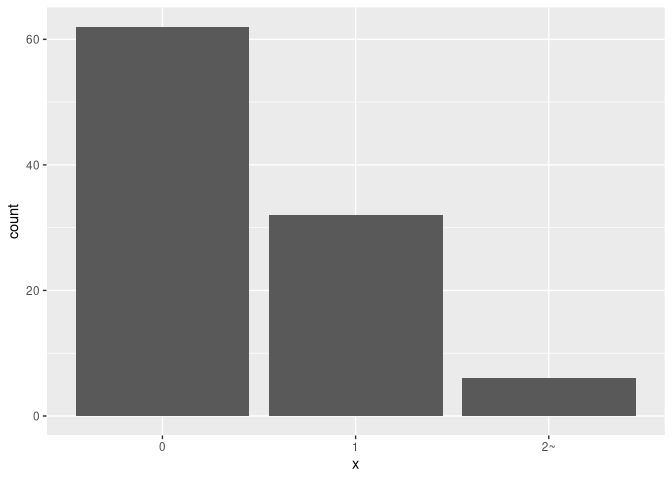

<!-- README.md is generated from README.Rmd. Please edit that file -->

# cutnumberint

<!-- badges: start -->

<!-- badges: end -->

A simple R package to provide only one function `cut_number_int()`, a
nicer version of `ggplot2::cut_number()`.

## Installation

    devtools::install_github("yutannihilation/cutnumberint")

## Example

`ggplot2::cut_number()` is one of the hidden gems in ggplot2. It’s
really neat, but I have two complaints about it. First, it cannot handle
0-inflated data.

    library(ggplot2)

    set.seed(403)
    x <- rpois(100, 0.5)

    cut_number(x, n = 3)
    #> Error: Insufficient data values to produce 3 bins.

Second one is a general complaint about `cut()`. For integer(-ish) data,
I want intuitive labels like `6~10` instead of `(5.5,10]`.

    cut_number(1:10, 2)
    #>  [1] [1,5.5]  [1,5.5]  [1,5.5]  [1,5.5]  [1,5.5]  (5.5,10] (5.5,10] (5.5,10]
    #>  [9] (5.5,10] (5.5,10]
    #> Levels: [1,5.5] (5.5,10]

`cut_number_int()` can handle these nicely.

    library(cutnumberint)

    cut_number_int(x, n = 3)
    #> Retrying calculation...
    #> Retrying calculation...
    #>   [1] 0  0  0  1  0  0  1  1  0  0  1  0  0  0  1  0  1  0  0  0  0  0  1  0  0 
    #>  [26] 0  0  0  0  1  0  0  2~ 0  0  2~ 2~ 0  0  0  0  0  1  1  0  0  0  0  0  0 
    #>  [51] 0  0  1  1  0  0  1  1  0  0  0  1  1  0  0  1  0  1  0  1  2~ 1  0  0  1 
    #>  [76] 0  1  1  1  1  1  0  0  2~ 0  0  1  1  0  0  0  1  0  0  1  0  2~ 1  0  1 
    #> Levels: 0 1 2~

    d <- data.frame(x = cut_number_int(x, n = 3))
    #> Retrying calculation...
    #> Retrying calculation...
    ggplot(d) +
      geom_bar(aes(x))

    table(cut_number_int(1:1000, 3))
    #> 
    #>   1~334 335~667    668~ 
    #>     334     333     333

### Caveats

For simplicity, this package handles only the cases where the inflated
values are located on the lowest bound. If it appears on the middle of
the data range, `cut_number_int()`.

    cut_number_int(c(0, rep(1, 100), 2:9), 5)
    #> Error: For simplicity, this function only takes care the cases when the inflated values are on the lowest bounds

If you need more powerful functions, probably you can find nicer binning
packages on CRAN.

-   <a href="https://www.r-pkg.org/search.html?q=binning" class="uri">https://www.r-pkg.org/search.html?q=binning</a>
